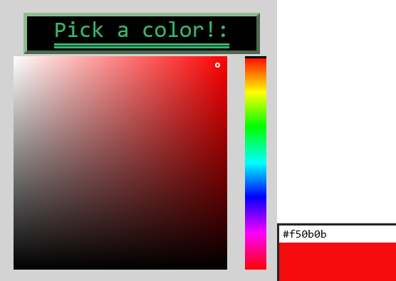
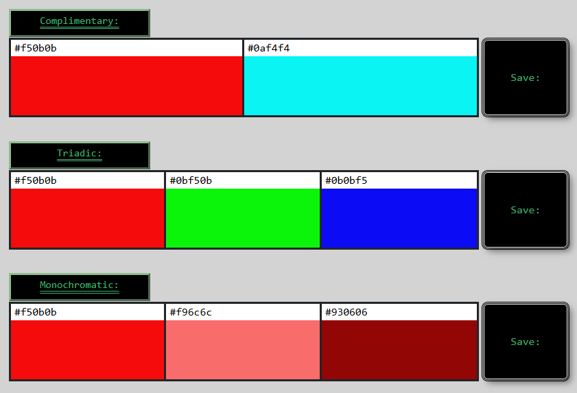
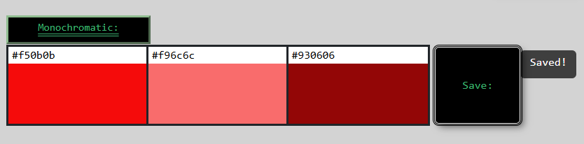
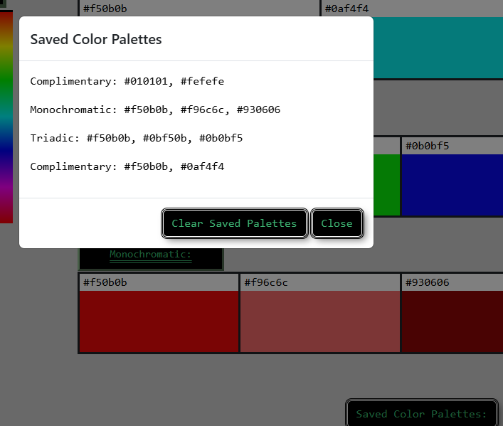
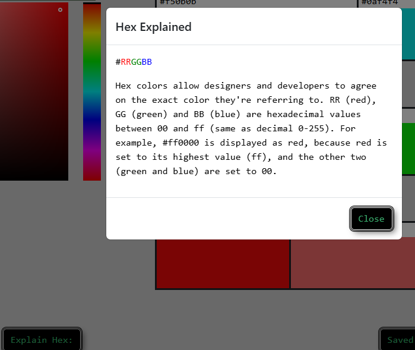

# color-palette-app

## Description:
The Color Palette application is designed to ease the process of narrowing down what hex codes are necessary to achieve an complementary, triadic, or monochromatic
color schemes. Choosing a color through the color selector presents you with the hex code for that color as well as three rows representing all of the color schemes and the associated hex codes. This project was built because of the necessity to provide a polished UI and easy access to achieve any of the included color schemes with every available hex code. This project helps to solve several problems. Users will find it easier to choose what colors to apply to their code. A monochromatic color scheme provides high contrast between colors allowing individuals with vision impairments better accessibility. During this project we learned the usefulness of implementing bootstrap into a project and how it can accelerate the development process. We also gained experience commiting and pulling to git and resolving any resulting merge conflcts. Finally, we were able to implement and reinforce our html, css, and javascript skills.

Link to the deployed page [here](https://zubrungus.github.io/color-palette-app/main/index.html)

## Tools Used:
* HTML 5 (Hyper Text Mark Up Language 5)
* CSS 3 (Cascading Style Sheets 3)
* JS (Java Script)

## Usage:
* Use color selector to choose color and recieve hexcode.

* Choose between complementary, triadic, or monochromatic color palette.

* Save color scheme to modal via the save button.

* Access saved color scheme modal through the modal button.

* Access hex color description modal through the modal button.

## Contributors:
* 'conversions.js' uses logic from James L. Milner's blog post [Converting RGB, Hex and HSL Colors with JavaScript & TypeScript](https://www.jameslmilner.com/posts/converting-rgb-hex-hsl-colors/).

* 'style.css' uses linear gradients from [colorjoe](https://github.com/bebraw/colorjoe/).

* Kayla Engelstad - Github: https://github.com/kengelstad16

* Kira Zeiglar - Github: https://github.com/kiralee97

* Nick Bappe - Github: https://github.com/Zubrungus

* Tristan Persaud - Github: https://github.com/TristanPPersaud